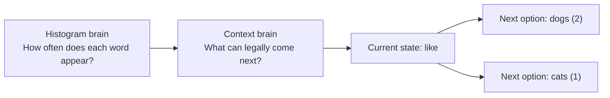
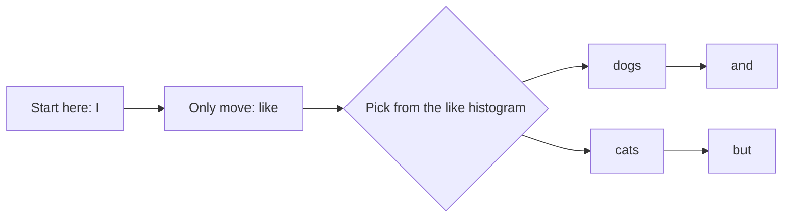
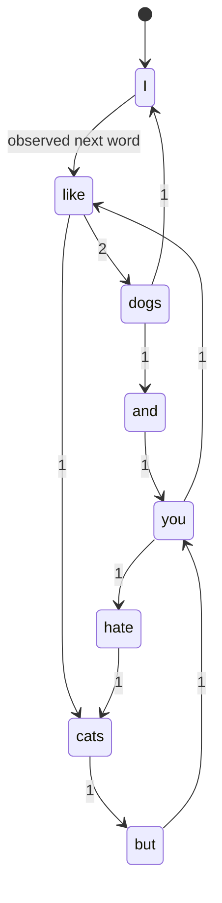
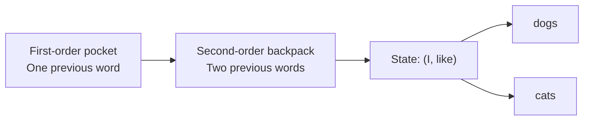
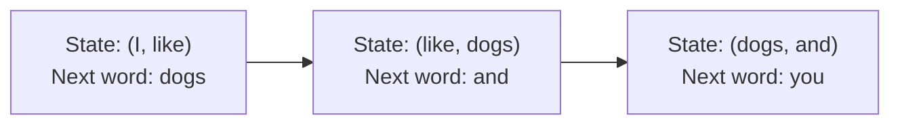

# Teach the Bot to Talk: Markov Chains for Tweet Generator

## Agenda

- [Learning Objectives](#learning-objectives)
- [Best Practices](#best-practices)
- [From Histogram to Markov Chain](#from-histogram-to-markov-chain)
  - [Overview: Why Histograms Are Not Enough](#overview-why-histograms-are-not-enough)
- [Random Walks and Sentence Generation](#random-walks-and-sentence-generation)
  - [Overview: How the Bot Picks the Next Word](#overview-how-the-bot-picks-the-next-word)
- [Second-Order Bridge](#second-order-bridge)
  - [Overview: How to Give the Bot More Memory](#overview-how-to-give-the-bot-more-memory)
- [Break & Wrap Up](#break-wrap-up)
- [After Class](#after-class)
- [After Class Challenges](#after-class-challenges)
  - [Challenge 1: Transition Audit](#challenge-1-transition-audit)
  - [Challenge 2: Walk It By Hand](#challenge-2-walk-it-by-hand)
  - [Challenge 3: Bigger Window, Better Output](#challenge-3-bigger-window-better-output)
- [Additional Resources](#additional-resources)

**Class Flow**

1. `0-4 min` Hook and retrieval
1. `4-10 min` Core concept explanation
1. `10-20 min` Worksheet 1 guided work
1. `20-30 min` Pseudocode and mini code build
1. `30-36 min` Worksheet 2 bridge
1. `36-40 min` Wrap-up and exit check

## Learning Objectives

By the end of this lesson, you should be able to:

1. Explain why a histogram alone is not enough to generate convincing sentences.
1. Describe a first-order Markov chain as a dictionary from a current word to a histogram of next words.
1. Generate a sentence by doing a random walk on a first-order Markov chain.
1. Explain how a second-order chain changes the state from one previous word to two previous words.

## Best Practices

- **Start with one tiny corpus.** If the sentence is short enough to fit in your head, you can actually see the pattern instead of pretending you understand it.
- **Separate the idea from the implementation.** First draw the states and transitions. Then write the Python-looking data structure. Then write the code.
- **Use the simplest data structure first.** For today, that means plain dictionaries. You do not need a class to understand the concept.
- **Make the chain legal before you make it elegant.** If the generated sentence follows valid observed transitions, you are on the right track even if the code is still rough.
- **Keep saying the next valid words out loud.** That sounds silly, but it works. If you can say the legal next words from a state, you understand the chain.
- **Do not smuggle in grammar rules.** A Markov chain is not checking grammar. It is counting what actually happened next in the source text.
- **Use case.** If your generator preserves frequency but still sounds like nonsense, you probably need context, not just more randomness.
- **Pro tip.** A first-order Markov chain is just nested counting plus weighted sampling.

**Builds On:** histogram counting, weighted sampling, dictionaries, and the sentence-generation work from earlier in the course.

**Feeds:** Page 7 of the Tweet Generator tutorial now, and Page 11 plus corpus work later.

## From Histogram to Markov Chain

### Overview: Why Histograms Are Not Enough

The problem is simple. A histogram tells you how often each token appears. It does not tell you what tends to come next.

That is why histogram sampling gets weird fast. It preserves frequency, but it loses local grammar. The word `fish` might be common. That does not mean `fish fish fish` is a good sentence.

So here is the move. We keep the counting idea from histograms, but we count transitions instead of just raw totals.

**Concrete example.** Use this text for the whole lesson:

`I like dogs and you like dogs. I like cats but you hate cats.`

Ignore punctuation for now. Then the token list is:

`['I', 'like', 'dogs', 'and', 'you', 'like', 'dogs', 'I', 'like', 'cats', 'but', 'you', 'hate', 'cats']`

Now the vocabulary matters less than the order.

- A **token** is one unit in the sequence. If the word `token` feels fancy, do not overthink it. In this lesson it mostly just means “one word-shaped piece from the text.”
- A **histogram** counts how often each token appears. Think of it like a scoreboard or a grocery receipt. It tells you totals. It does not tell you order.
- **Context** means what came right before the current choice. This is the missing ingredient.
- A **state** is the context we are currently using. Think of it like the square you are standing on in a board game.
- A **transition** is a legal move from one state to the next observed result. Think of it like an arrow you are allowed to follow.

For a first-order Markov chain, the state is just one word. That means the question becomes:

`Given this current word, what words have actually followed it before?`

That is the whole idea. Nothing more magical is happening here.

**Diagram: from raw counts to legal next moves.**



**What this looks like in class.** Start with the word `like`. Ask the room what can legally come after it in the source text. They should be able to answer `dogs` and `cats`. That moment matters because it turns the chain from abstract vocabulary into a visible set of legal moves.

**Worksheet 1: histogram to first-order chain.** Use [Histogram & Markov Chain Worksheet](../Worksheets/Histogram_MarkovChains.pdf).

- Q1-Q3 are the warm-up. Students review types, tokens, and the histogram shape in Python.
- Q4 is the first real leap. They draw states and directed transitions with counts.
- Q5 makes them isolate one state like `like` and write its outgoing histogram.
- Q6 makes them prove they understand the model by generating one legal sentence.

Run the worksheet in three passes:

1. conceptualize it by hand
1. write the Python-looking data structure
1. write pseudocode for how a program builds it

## Random Walks and Sentence Generation

### Overview: How the Bot Picks the Next Word

Once the chain exists, sentence generation gets much simpler.

You pick a starting state. Then you follow one legal transition. Then you land in a new state. Then you do it again.

That is a random walk. If that phrase feels too mathy, ignore the fancy label. It just means you keep choosing the next legal step, one move at a time, until you stop.

If the chain says `like -> dogs` happened twice and `like -> cats` happened once, then `dogs` should be more likely to come next. That is where your earlier sampling work comes back in. You already know how to sample from a histogram. Now you are just sampling from a smaller histogram attached to one state.

**Concrete example.** If you start at `I`, the only observed next word is `like`. From `like`, you can go to `dogs` or `cats`. From `dogs`, one legal next word is `and`. From `cats`, one legal next word is `but`.

That is why the generator starts sounding more sentence-like. It is no longer choosing from all words. It is choosing from words that actually followed the current state in the source text.

Another way to say it: a histogram is like shaking every word in the whole bag and pulling one out. A Markov chain is like saying, “Given where I am standing right now, what doors are actually in front of me?”

**Diagram: random walk on the chain.**



**Diagram: state-machine view.**



**Mini build.** Keep the implementation plain. Do not turn this into an OOP lecture.

First-order pseudocode:

```text
chain = {}

for each pair of adjacent words:
    current_word = words[i]
    next_word = words[i + 1]

    if current_word not in chain:
        chain[current_word] = {}

    if next_word not in chain[current_word]:
        chain[current_word][next_word] = 0

    chain[current_word][next_word] += 1
```

This is the worksheet shape. It is the easiest way to see the concept because it matches what students draw on paper for Q4 and Q5.

The Python shape students should be able to imagine by the end looks something like this:

```python
EXAMPLE_CHAIN = {
    'I': {'like': 2},
    'like': {'dogs': 2, 'cats': 1},
    'dogs': {'and': 1, 'I': 1},
    'and': {'you': 1},
    'you': {'like': 1, 'hate': 1},
    'cats': {'but': 1},
    'but': {'you': 1},
    'hate': {'cats': 1}
}
```

That shape is enough to understand the chain. If you want the code to line up with the histogram work from earlier in the course, then each state can store a `Dictogram` instead of a plain inner dictionary.

Runnable version using `Dictogram` objects:

```python
from dictogram import Dictogram


def build_chain(words):
    """Build a first-order Markov chain from a list of words."""
    chain = {}
    for i in range(len(words) - 1):
        current_word = words[i]
        next_word = words[i + 1]

        if current_word not in chain:
            chain[current_word] = Dictogram()

        chain[current_word].add_count(next_word)

    return chain
```

Random walk loop:

1. pick a starting state
1. sample from that state's histogram
1. append the result
1. move to the next state
1. stop when you get stuck or hit your target length

If you want a tiny code skeleton for the board, keep it this small:

```python
def walk_chain(chain, start_word, num_words):
    """Generate text by taking a random walk through the chain."""
    words = [start_word]
    current_word = start_word

    for _ in range(num_words - 1):
        if current_word not in chain:
            break

        next_word = chain[current_word].sample()
        words.append(next_word)
        current_word = next_word

    return ' '.join(words)
```

**What this looks like in class.** Build the first few states together, stop early, and make students finish the rest on the worksheet. The point is not to impress them with code. The point is to make the nested-counting pattern obvious.

## Second-Order Bridge

### Overview: How to Give the Bot More Memory

First-order chains are useful, but they still forget too much.

They only remember one previous word. Sometimes that is enough. Sometimes it is not.

If you want more context, you make the state bigger.

In a second-order Markov chain, the state is a pair of previous words. That means the key is no longer one word like `like`. The key is a tuple like `('I', 'like')`.

The value is still the same kind of thing: a histogram of next words.

So the idea does not change. The memory window changes.

**Concrete example.** In a first-order chain, `like` can lead to both `dogs` and `cats`. In a second-order chain, `('you', 'like')` may lead somewhere different from `('I', 'like')` if the corpus supports that distinction.

That is the whole payoff. Bigger window, better local memory.

Here is the plain-English version. First-order is like remembering the last thing someone said. Second-order is like remembering the last two things they said. Same conversation. Better memory.

Second-order bridge pseudocode:

```text
for i in range(len(words) - 2):
    state = (words[i], words[i + 1])
    next_word = words[i + 2]
```

That is it. Same structure. Bigger key.

If you want the runnable version to match the first-order code style, it looks like this:

```python
from dictogram import Dictogram


def build_second_order_chain(words):
    """Build a second-order Markov chain from a list of words."""
    chain = {}
    for i in range(len(words) - 2):
        state = (words[i], words[i + 1])
        next_word = words[i + 2]

        if state not in chain:
            chain[state] = Dictogram()

        chain[state].add_count(next_word)

    return chain
```

**Diagram: bigger memory window.**



**Diagram: sliding window for second-order states.**



**Worksheet 2: bigger window.** Use [Higher Order Markov Chains Worksheet](../Worksheets/MarkovChains_HigherOrder.pdf).

- Q1 introduces the three-word window.
- Q2 turns that window into pair states and next-word transitions.
- Q3 makes students print the tuple-key dictionary shape.
- Q4 makes them test whether they can still do a legal random walk.

Use the same three passes again:

1. conceptualize it by hand
1. write the Python-looking structure
1. write pseudocode for how the program builds it

**What this looks like in class.** Keep this section tight. You are not teaching nth-order architecture today. You are showing students that higher-order chains are not a new idea. They are the same idea with a wider memory window.

## Break & Wrap Up

**Key takeaway:** A histogram tells you what exists. A Markov chain tells you what tends to come next.

That difference is why the generator starts to sound less random in the bad way and more random in the interesting way.

If students leave with one clean sentence in their head, it should be this:

`A first-order Markov chain is a dictionary where each current word points to a histogram of next words.`

### Pro Tip: Do Not Let the Class Jump to OOP Too Early

Beginners love to think a class will save them from confusion. Usually it just hides the real idea under more syntax. Teach the nested dictionary first. Wrap it in a class later if you want cleaner organization.

### Instructor Closing Loop

Close by naming the three habits you want them to keep:

1. count the transitions, not just the tokens
1. separate the diagram from the code
1. make the random walk follow only legal observed moves

Then ask one quick exit question:

`What changes when we go from first-order to second-order?`

The answer you want is simple:

`The state gets bigger. The idea stays the same.`

If the room still looks fuzzy, say it one more way:

`First-order remembers one word. Second-order remembers two. Everything else is the same counting game.`

## After Class

1. Complete [Page 7: Generating Sentences][page 7: generating sentences] of the Tweet Generator tutorial.
1. Finish both Markov worksheets if you did not finish them in class.
1. Submit both worksheets on Gradescope.

## After Class Challenges

### Challenge 1: Transition Audit

Take a short source text of your own and build the first-order chain by hand.

1. Write the token list.
1. Write the transition counts.
1. Write the final nested dictionary.
1. Check whether every transition in your dictionary came from a real adjacent pair in the source.

### Challenge 2: Walk It By Hand

Use your first-order chain without writing code yet.

1. Pick a starting word.
1. Follow legal transitions for at least six steps.
1. Write the sentence you generated.
1. Mark the exact state histogram you used at each step.

If you cannot explain each move, you do not understand the walk yet.

### Challenge 3: Bigger Window, Better Output

Compare first-order and second-order output on the same tiny corpus.

1. Build a first-order chain.
1. Build a second-order chain.
1. Generate one sentence from each.
1. Explain what the larger state remembered that the smaller state lost.

## Additional Resources

### Source Notes

Start with the tutorial and worksheets. Then use the outside resources to sharpen the concept, not replace it.

1. [Page 7: Generating Sentences][page 7: generating sentences]: the direct implementation follow-up for this lesson
1. [Page 11: Markov Chains Revisited][page 11: markov chains revisited]: the teacher-facing bridge into second-order thinking
1. [Page 12: Creating a Corpus][page 12: creating a corpus]: where this work goes next once the generator logic is working
1. [Histogram & Markov Chain Worksheet](../Worksheets/Histogram_MarkovChains.pdf): in-class first-order concept and structure work
1. [Higher Order Markov Chains Worksheet](../Worksheets/MarkovChains_HigherOrder.pdf): in-class bridge to pair-state thinking
1. [Victor Powell's visual explanation of Markov chains][visual explanation of markov chains]: best for intuitive state and transition diagrams
1. [Alex Dejeu's article on how Markov chains work][dejeu markov article]: useful for explaining why bigger windows change the model
1. [Dataiku's article on Markov chains with back-off][dataiku markov article]: useful for explaining why more context can improve output quality

[dataiku markov article]: https://blog.dataiku.com/2016/10/08/machine-learning-markov-chains-generate-clinton-trump-quotes
[dejeu markov article]: https://hackernoon.com/from-what-is-a-markov-model-to-here-is-how-markov-models-work-1ac5f4629b71
[page 7: generating sentences]: https://tech-at-du.github.io/Tweet-Generator/#/P06-Generating-Sentences/README
[page 11: markov chains revisited]: https://tech-at-du.github.io/Tweet-Generator/#/P10-Markov-Chains-Revisited/README
[page 12: creating a corpus]: https://tech-at-du.github.io/Tweet-Generator/#/P11-Creating-a-Corpus/README
[visual explanation of markov chains]: http://setosa.io/blog/2014/07/26/markov-chains/
